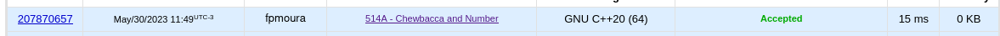

Questão do site [CodeForces](https://codeforces.com) do contest Codeforces Round 291 (Div. 2).

O problema consistia em inverter os digitos de um número (9-t) ou não, para gerar o menor número positivo possível.

Para isso, foi se avaliando digito por dígito, e caso esse fosse igual ou maior que 5, realizava-se a inversão.

