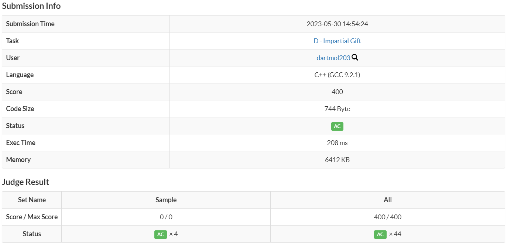

Questão do site [AtCoder](https://atcoder.jp/) do contest ABC 302 letra D

O problema consistia em encontrar a maior soma de valor entre 2 presentes, em que a diferença entre os 2 valores não pode ser maior que um inteiro dado.

Foi utilizado uma visão gulosa de dois ponteiros para se escolher os maiores valores de cada opção de presente..

