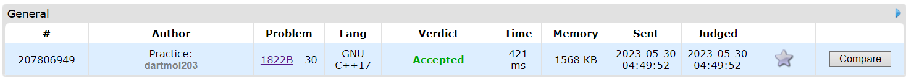

Questão do site [CodeForces](https://codeforces.com) do contest Codeforces Round 867 (Div. 3) letra B

O problema consistia identiticar a maior multiplicação entre dois numeros adjacentes do array, podendo retirar quantos numeros do array forem necessarios, deve-se retornar o produto dos valores.

Foi utilizado uma visão gulosa em que se é visto os maiores e menores numeros do vetor (já ordenado) olhando as duas pontas do vetor.

