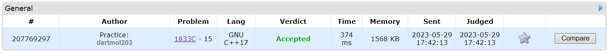

Questão do site [CodeForces](https://codeforces.com) do contest Codeforces Round 874 (Div. 3) letra C

O problema consistia identiticar se é possivel deixar todo um vetor com numeros positivos e de mesma paridade.

Foi utilizado uma visão gulosa em que se verificava se todos os numeros eram já da mesma paridade, caso não, tem que se vericar se o menor numero é impar, caso não, é impossivel deixar todos com mesma paridade e positivos, visto que subtrair um numero par de qualquer numero mantem a paridade do mesmo, e um impar inverte a paridade.

